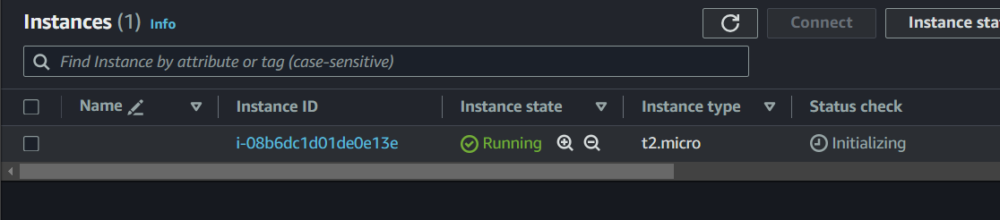

Je connaissais déjà Terraform de nom car quand j'ai commencé dans mon entreprise on voulait commencer à automatiser la création sur AWS et on hésitait entre Terraform et Cloudformation.

# Source
https://developer.hashicorp.com/terraform/tutorials/aws-get-started/install-cli
https://docs.aws.amazon.com/fr_fr/cli/latest/userguide/getting-started-install.html
https://devopssec.fr/article/premiere-infrastructure-aws-terraform

# Installation Terraform
choco install terraform

# Installation AWS CLI
msiexec.exe /i https://awscli.amazonaws.com/AWSCLIV2.msi

# Créer USER IAM
Sur votre compte AWS créer un utilisateur et créer un group qui aura accès en Administrateur/

Cette parti là j'ai eu une difficulté parce que je n'arrivais as à trouver où je devais créer l'access list. En cherchant j'ai trouvé.

Après avoir créer l'utisateur il faut cliquer dessus puis aller sur Security Credentials puis crée une access key.

# Code terraform

