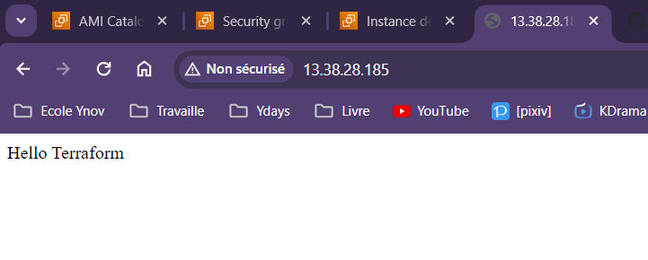

# Source

https://registry.terraform.io/providers/hashicorp/aws/latest/docs/resources/security_group

# Ajouter un script lors du lancement d'une machine

# Debug

La machine se crée bien mais rien ne s'affichait. Donc j'ai ajouté le port 22 pour pouvoir me connecter en SSH et voir si le script que j'avais mis ce faisait bien. Le script ne s'exécutait pas donc je suis partie vérifier mon code.
Après vérification j'avais oublié un tiret dans la partie user_data.
